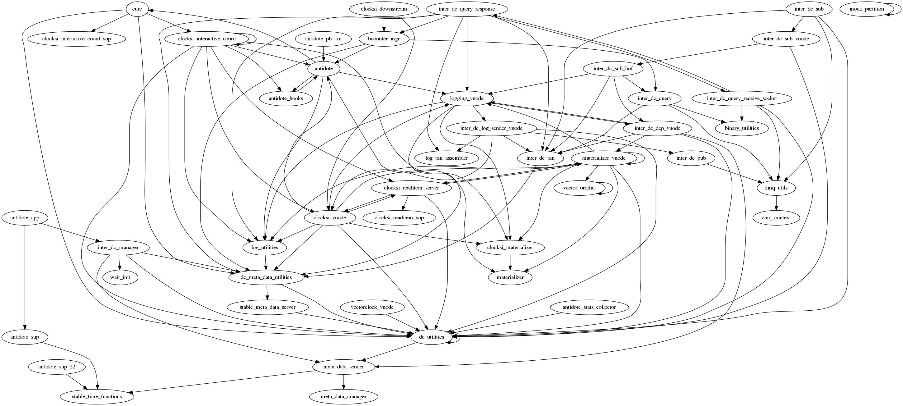

# Current Antidote Module Dependency Graph:

# Graph Generation:

* Generate current file list:
  * Place sh script into same directory as the antidote folder
  * Run script and pipe output into files.txt

* Generate dependency graph:
  * Place jar, .scrape file, and files.txt into same directory as the antidote folder
  * Run `java -jar app.jar`, this produces the desired dot file in the same directory
